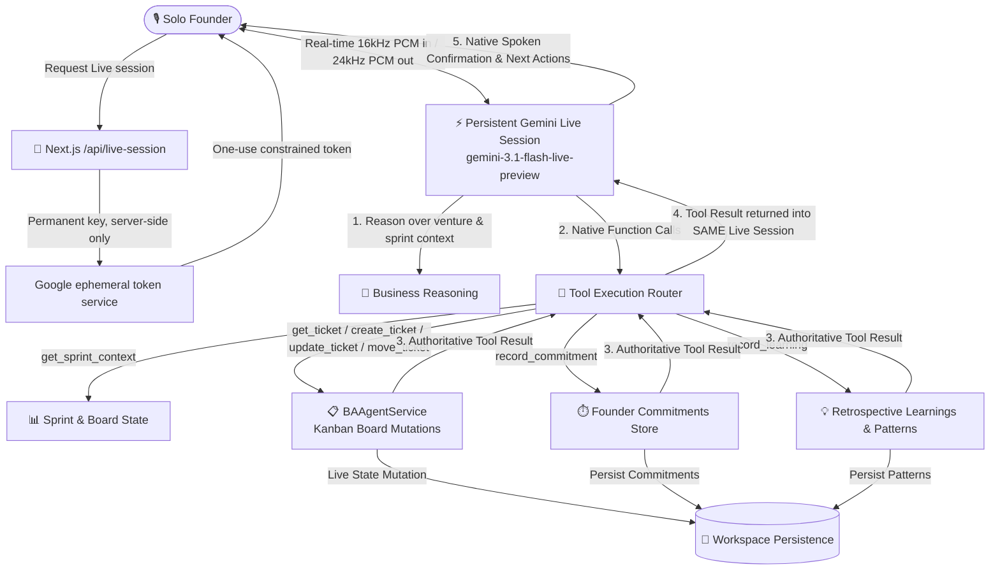

# FounderAlly — Real-Time Adaptive AI Business Analyst for Solo Founders

> **You may be building solo, but you have an AI Business Analyst who understands the work, challenges your assumptions, remembers what you committed to, and turns up every morning.**

FounderAlly pairs solo founders with a selectable team of AI business advisors powered by **Google Gemini Live**, native tool execution, and adaptive sprint memory.

---

## 🏗️ Architecture Overview



---

## 🌟 Key Capabilities

### 1. Real-Time Bidirectional Voice Agent (`GeminiLiveService`)
- Uses `@google/genai` `ai.live.connect()` with a one-use, short-lived token constrained by the server to the configured Live model and session configuration.
- Native 16kHz PCM audio streaming with Google's **`Kore`** and **`Aoede`** expressive neural voices.
- Natural barge-in interruption: when the founder speaks mid-sentence, playback halts and the agent answers.
- If token provisioning, microphone access, or Live transport fails, the UI switches to browser speech recognition → `/api/ai-analyst` → server-side Gemini TTS. Low-quality OS speech synthesis is disabled by default; it can be explicitly enabled with `NEXT_PUBLIC_ENABLE_BROWSER_TTS_FALLBACK=true`.

### 2. The 7 Authoritative MVP Tools
1. `get_sprint_context` — Retrieves current sprint goal, board columns, active commitments, and completion rate.
2. `get_ticket` — Authoritative lookup of ticket details, acceptance criteria, and blocker notes.
3. `create_ticket` — Converts spoken agreements into structured Kanban tickets with categories and priorities.
4. `update_ticket` — Refines acceptance criteria, updates descriptions, or flags blockers.
5. `move_ticket` — Moves tickets between columns (`backlog`, `today`, `in_progress`, `done`, `blocked`) and returns verified results.
6. `record_commitment` — Records explicit founder commitments for morning accountability.
7. `record_learning` — Stores authenticated, venture-scoped retrospective learnings and recurring behavioral patterns when database persistence is configured.

### 3. Proactive Stand-up Preparation (`StandupPrepEngine`)
- Analyzes active tickets, carried-over work, unfulfilled commitments, and sprint goal alignment before stand-up begins.
- Opens stand-ups with substantive, goal-oriented observations rather than generic greetings.

### 4. Adaptation & Behavioral Coaching
- Persists explicit learnings, founder commitments, memory facts, and AI Ops executions through authenticated server routes scoped to the Clerk user and venture.
- Keeps a user-scoped browser cache for offline/demo resilience and injects hydrated facts and learnings into later Live-session instructions.
- Detects coaching patterns only from completed sprint history; the production store no longer seeds fictional "observed" behavior.

### 5. Auditable AI Operations & Telemetry
- Inspect live tool executions, latency benchmarks, success rates, and Gemini models via the **AI Ops** telemetry dashboard.

---

## 🚀 Getting Started

### 1. Install Dependencies
```bash
npm install
```

### 2. Configure Environment Variables
Create `.env.local`:
```env
# Google Gemini API Key (from https://aistudio.google.com/)
GEMINI_API_KEY=AIzaSyYourGoogleApiKeyHere

# Clerk Authentication
NEXT_PUBLIC_CLERK_PUBLISHABLE_KEY=pk_test_...
CLERK_SECRET_KEY=sk_test_...

# Supabase (required for cross-device durable persistence)
NEXT_PUBLIC_SUPABASE_URL=https://your-project.supabase.co
NEXT_PUBLIC_SUPABASE_PUBLISHABLE_KEY=sb_publishable_...
SUPABASE_SECRET_KEY=sb_secret_... # server-only; never prefix with NEXT_PUBLIC_

# Feature Flag: Refocused AI Business Analyst Experience
SHOW_ADVANCED_FEATURES=false
NEXT_PUBLIC_SHOW_ADVANCED_FEATURES=false
```

Do not define or use `NEXT_PUBLIC_GEMINI_API_KEY`. The permanent Gemini credential must never be compiled into browser JavaScript. The configured key must be a Gemini Developer API key authorized to create ephemeral Live tokens; an OAuth token or unsupported credential will be rejected.

Model configuration is centralized in `lib/config/geminiConfig.ts`. Live audio uses `gemini-3.1-flash-live-preview`. Text requests try `gemini-3.7-flash`, `gemini-flash-latest`, then `gemini-3.1-flash-lite`. TTS fallback uses the dedicated `gemini-3.1-flash-tts-preview` model; text-only Flash models cannot replace a Live or TTS model.

Advisor identity and voice configuration lives in `lib/config/advisorPersonas.ts`. Maya Chen defaults to Gemini Sulafat (warm), Marcus Reed to Charon (informative), and Priya Nair to Erinome (clear). The Co-Pilot picker also exposes all 30 Gemini prebuilt voices. Each venture persists its own advisor and voice selection, and that project-specific identity, portrait, voice, and speaking direction are applied to both Gemini Live and server-generated TTS fallback audio.

### 3. Run Development Server
```bash
npm run dev
```
Open [http://localhost:3000](http://localhost:3000) to access the dashboard.

---

## 🧪 Testing the Voice Agent Demo Scenario

1. Open **`http://localhost:3000/dashboard`** and click the **Stand-up** tab.
2. Click **"Connect Live Voice Standup"**.
3. **Founder**: *"I spent yesterday polishing the dashboard animations."*
4. **Advisor**: Challenges the distraction against the sprint goal (*"Our sprint goal is customer validation. Dashboard animations aren't helping us reach it right now. I recommend moving that ticket back to the backlog."*)
5. **Founder**: *"Yeah, do it."*
6. **Advisor**: Calls `move_ticket`. FounderAlly changes the board and sends the authoritative result back through `session.sendToolResponse(...)`; only then should the advisor confirm the move and continue.
7. **Founder**: *"I'll contact all six."*
8. **Advisor**: Calls `record_commitment` and records it for tomorrow's stand-up.

---

## 🔒 Security & Best Practices
- **No permanent key in the browser**: `/api/live-session` exchanges the server-only `GEMINI_API_KEY` for a one-use, short-lived Gemini credential. The ephemeral credential is expected to be visible to the browser; the permanent key is not.
- **Graceful Fallbacks**: If WebSocket streaming is unavailable, the application automatically falls back to the HTTP contextual engine.

## Persistence and current scope

Commitments, learnings, memory facts, and AI Ops events persist in Supabase through Clerk-authenticated, venture-scoped server routes after applying `supabase/migrations/20260817120000_durable_founder_memory.sql` and configuring the modern `SUPABASE_SECRET_KEY` (`sb_secret_...`). A user-scoped browser cache preserves the demo when the database is temporarily unavailable. Venture board/chat state remains browser-backed. Documents remain in the primary navigation. Strategy, Assumptions, Requirements, Experiments, Metrics, and Roadmap remain behind `SHOW_ADVANCED_FEATURES`.
